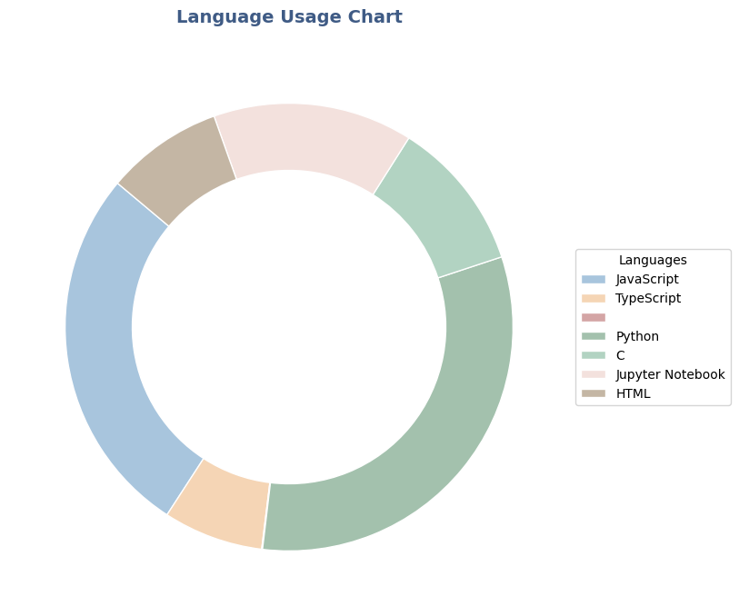

# Hi there 👋

## Stats
>
## Language Usage

>[!NOTE]
> **Last updated: 2025-01-24 14:39:39 UTC**

>  
>  
>   

>[!CAUTION]
> **language_usage = total_steps_languages:** 

- Python: 26.34%
- None: 1.28%
- HTML: 5.65%
- C: 28.6%
- Jupyter Notebook: 37.68%
- JavaScript: 0.29%
- CSS: 0.17%

## Language Details (Top 3)

### Jupyter Notebook
- File count: 140
- Max steps in a file: 514055

### C
- File count: 488
- Max steps in a file: 86680

### Python
- File count: 5339
- Max steps in a file: 478706
