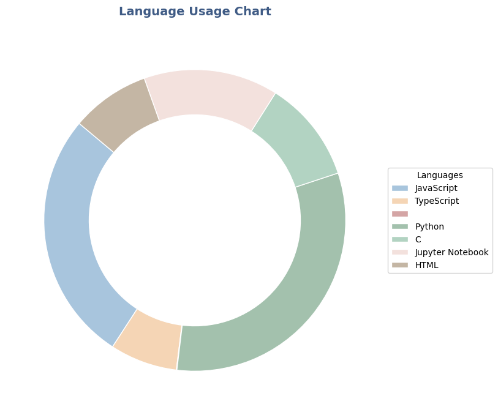

# Hi there 👋

## Stats
>
## Language Usage

>[!NOTE]
> **Last updated: 2026-02-01 05:14:47 UTC**

>  
>  
>   

>[!CAUTION]
> **language_usage = total_steps_languages:** 

- JavaScript: 26.53%
- TypeScript: 7.13%
- None: 0.07%
- Python: 30.95%
- HTML: 10.36%
- C: 10.77%
- Jupyter Notebook: 14.19%

## Language Details (Top 3)

### Python
- File count: 46113
- Max steps in a file: 716465

### JavaScript
- File count: 1533
- Max steps in a file: 987100

### Jupyter Notebook
- File count: 140
- Max steps in a file: 514055
