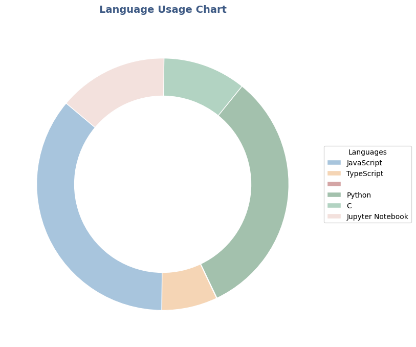

# Hi there 👋

## Stats
>
## Language Usage

>[!NOTE]
> **Last updated: 2026-06-01 07:33:36 UTC**

>  
>  
>   

>[!CAUTION]
> **language_usage = total_steps_languages:** 

- JavaScript: 36.0%
- TypeScript: 7.14%
- None: 0.06%
- Python: 32.09%
- C: 10.66%
- Jupyter Notebook: 14.05%

## Language Details (Top 3)

### JavaScript
- File count: 2155
- Max steps in a file: 987100

### Python
- File count: 49581
- Max steps in a file: 716465

### Jupyter Notebook
- File count: 141
- Max steps in a file: 514055
