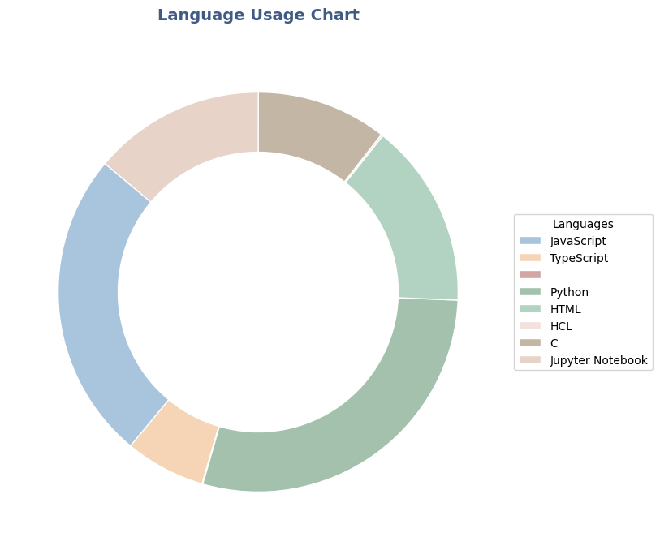

# Hi there 👋

## Stats
>
## Language Usage

>[!NOTE]
> **Last updated: 2025-06-01 06:39:08 UTC**

>  
>  
>   

>[!CAUTION]
> **language_usage = total_steps_languages:** 

- JavaScript: 9.44%
- TypeScript: 2.8%
- None: 0.02%
- Python: 74.02%
- HTML: 3.96%
- Dart: 0.52%
- Vue: 0.02%
- Shell: 0.0%
- Rust: 0.0%
- Jupyter Notebook: 5.25%
- C++: 0.01%
- Objective-C: 0.01%
- C: 3.96%

## Language Details (Top 3)

### Python
- File count: 56380
- Max steps in a file: 987351

### JavaScript
- File count: 1482
- Max steps in a file: 987100

### Jupyter Notebook
- File count: 154
- Max steps in a file: 514055
